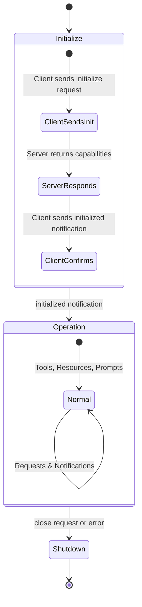
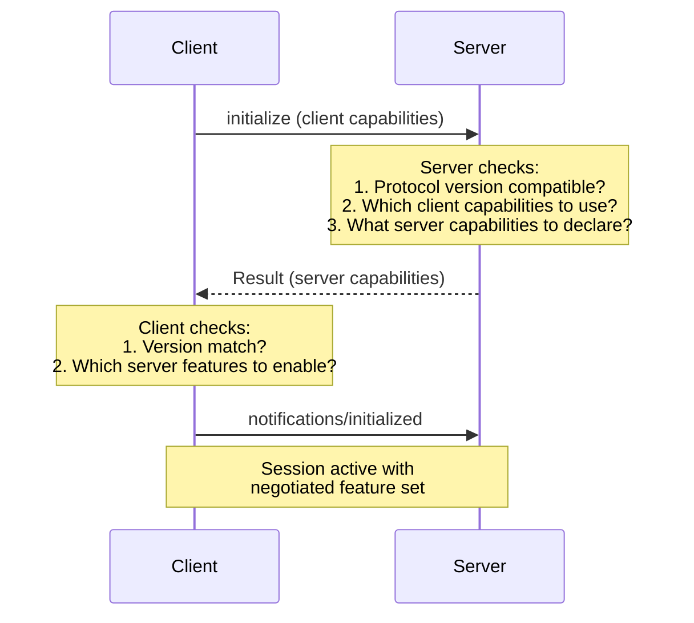
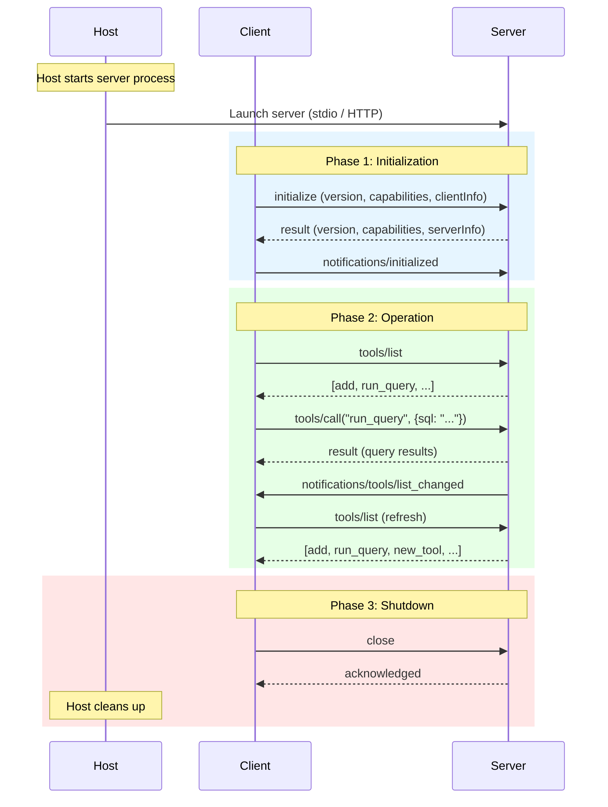

# Chapter 3: Protocol Lifecycle & Capability Negotiation

## Learning Objectives

By the end of this chapter, you will:

- Understand the three phases of an MCP session lifecycle
- Know exactly what happens during the initialization handshake
- Grasp how capability negotiation determines session features
- Read and write real MCP initialization messages

---

## The Three Phases

Every MCP session follows a strict lifecycle with three phases:



| Phase | Purpose | Duration |
|-------|---------|----------|
| **Initialize** | Exchange versions, negotiate capabilities | Brief (one-time) |
| **Operation** | Normal request/response flow | Bulk of the session |
| **Shutdown** | Clean termination | Brief |

---

## Phase 1: Initialization

Initialization is a **three-step handshake** between client and server. No other requests are allowed until this completes.

### Step 1: Client Sends `initialize` Request

The client sends its protocol version, capabilities, and identity:

```json
{
  "jsonrpc": "2.0",
  "id": 1,
  "method": "initialize",
  "params": {
    "protocolVersion": "2025-11-25",
    "capabilities": {
      "roots": {
        "listChanged": true
      },
      "sampling": {},
      "elicitation": {
        "form": {},
        "url": {}
      }
    },
    "clientInfo": {
      "name": "MyAIApp",
      "version": "1.0.0"
    }
  }
}
```

**Key fields:**

| Field | Purpose |
|-------|---------|
| `protocolVersion` | The latest version the client supports |
| `capabilities` | What the client can do (sampling, roots, elicitation) |
| `clientInfo` | Human-readable identification |

### Step 2: Server Responds with Its Capabilities

The server returns its own protocol version, capabilities, and identity:

```json
{
  "jsonrpc": "2.0",
  "id": 1,
  "result": {
    "protocolVersion": "2025-11-25",
    "capabilities": {
      "tools": {
        "listChanged": true
      },
      "resources": {
        "subscribe": true,
        "listChanged": true
      },
      "prompts": {
        "listChanged": true
      },
      "logging": {}
    },
    "serverInfo": {
      "name": "PostgresServer",
      "version": "2.0.0"
    },
    "instructions": "This server provides PostgreSQL database access. Use the run_query tool to execute SQL queries."
  }
}
```

**Key fields:**

| Field | Purpose |
|-------|---------|
| `protocolVersion` | The version the server agrees to use |
| `capabilities` | What the server supports |
| `serverInfo` | Human-readable identification |
| `instructions` | Optional guidance for the LLM on how to use this server |

### Step 3: Client Sends `initialized` Notification

The client confirms that it has processed the server's capabilities:

```json
{
  "jsonrpc": "2.0",
  "method": "notifications/initialized"
}
```

> **Note**: This is a notification (no `id`), not a request. The server doesn't respond to it. After this, both sides enter the **Operation** phase.

---

## Capability Negotiation

Capability negotiation is the most important part of initialization. It determines **which features are available** for the rest of the session.

### Client Capabilities

The client declares what it can handle from the server:

| Capability | Meaning |
|-----------|---------|
| `roots` | Client can provide workspace root URIs to the server |
| `roots.listChanged` | Client will notify when roots change |
| `sampling` | Client supports server-initiated LLM completion requests |
| `elicitation` | Client supports server-initiated user input requests |

### Server Capabilities

The server declares what it provides:

| Capability | Meaning |
|-----------|---------|
| `tools` | Server exposes callable tools |
| `tools.listChanged` | Server will notify when tool list changes |
| `resources` | Server exposes readable resources |
| `resources.subscribe` | Client can subscribe to resource changes |
| `resources.listChanged` | Server will notify when resource list changes |
| `prompts` | Server provides prompt templates |
| `prompts.listChanged` | Server will notify when prompt list changes |
| `logging` | Server supports sending log messages |
| `completions` | Server supports argument auto-completion |

### How Negotiation Works



**Rules:**

1. Both sides **must respect** declared capabilities for the entire session
2. If a server doesn't declare `tools`, the client **must not** send `tools/call`
3. If a client doesn't declare `sampling`, the server **must not** request completions
4. The protocol version must be agreed upon — if incompatible, the connection fails

### Example: Minimal Server

A server that only provides tools (no resources, no prompts):

```json
{
  "capabilities": {
    "tools": {}
  }
}
```

### Example: Full-Featured Server

A server that supports everything:

```json
{
  "capabilities": {
    "tools": { "listChanged": true },
    "resources": { "subscribe": true, "listChanged": true },
    "prompts": { "listChanged": true },
    "logging": {},
    "completions": {}
  }
}
```

---

## Protocol Version Negotiation

MCP uses **date-based versioning** (e.g., `2025-11-25`). The negotiation follows these rules:

1. Client sends the **latest version** it supports
2. Server responds with the version it will use (must be ≤ client's version)
3. If the server can't support any compatible version, it returns an error
4. Both sides use the **agreed version** for the rest of the session

```
Client supports: 2025-11-25
Server supports: 2025-11-25, 2024-11-05

→ Agreed version: 2025-11-25 ✓
```

```
Client supports: 2024-11-05
Server supports: 2025-11-25 only

→ Error: incompatible versions ✗
```

---

## Phase 2: Operation

Once initialization completes, the session enters the **Operation** phase. This is where the actual work happens:

### Request Types

| Direction | Method | Purpose |
|-----------|--------|---------|
| Client → Server | `tools/list` | Discover available tools |
| Client → Server | `tools/call` | Invoke a tool |
| Client → Server | `resources/list` | Discover available resources |
| Client → Server | `resources/read` | Read a resource |
| Client → Server | `prompts/list` | Discover available prompts |
| Client → Server | `prompts/get` | Get a prompt with arguments |
| Server → Client | `sampling/createMessage` | Request LLM completion |
| Server → Client | `elicitation/create` | Request user input |

### Notification Types

| Direction | Method | Purpose |
|-----------|--------|---------|
| Server → Client | `notifications/tools/list_changed` | Tool list was updated |
| Server → Client | `notifications/resources/list_changed` | Resource list was updated |
| Server → Client | `notifications/resources/updated` | A specific resource changed |
| Server → Client | `notifications/prompts/list_changed` | Prompt list was updated |
| Client → Server | `notifications/roots/list_changed` | Client's roots changed |
| Either direction | `notifications/progress` | Progress update for long operations |
| Either direction | `notifications/cancelled` | Cancel an in-progress request |

### Ping

Either side can send a `ping` to check if the other is still alive:

```json
{
  "jsonrpc": "2.0",
  "id": 99,
  "method": "ping"
}
```

Response:

```json
{
  "jsonrpc": "2.0",
  "id": 99,
  "result": {}
}
```

---

## Phase 3: Shutdown

Sessions can end in several ways:

### Clean Shutdown

1. Client sends a `close` request or closes the transport
2. Server cleans up resources and exits
3. Both sides release the connection

### Abnormal Termination

- Transport disconnection (process crash, network failure)
- Protocol error (incompatible messages)
- Timeout (no response within expected window)

### Best Practices for Shutdown

- Servers should clean up external resources (DB connections, file handles)
- Clients should handle server disconnections gracefully
- Hosts should be able to restart failed server connections

---

## Putting It All Together

Here's a complete lifecycle from start to finish:



---

## Summary

- MCP sessions have three phases: **Initialize**, **Operation**, **Shutdown**
- Initialization is a three-step handshake: `initialize` request → response → `initialized` notification
- **Capability negotiation** determines which features are available for the session
- Clients declare support for sampling, roots, and elicitation
- Servers declare support for tools, resources, prompts, logging, and completions
- **Protocol version** is negotiated during initialization (date-based versioning)
- During operation, both sides exchange **requests** and **notifications**
- Shutdown should be graceful, with proper resource cleanup

---

## What's Next

In **Chapter 4**, we'll dive into the first (and most powerful) primitive: **Tools** — how LLMs discover and invoke executable functions.
