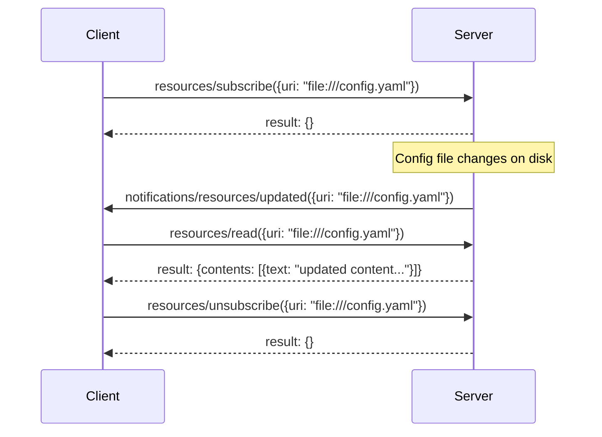

# Chapter 5: Resources — Exposing Data to LLMs

## Learning Objectives

By the end of this chapter, you will:

- Understand what MCP resources are and how they differ from tools
- Know the difference between static and dynamic (template) resources
- Read and write resource definitions and responses
- Build resources in Python using the `@mcp.resource()` decorator
- Handle subscriptions and change notifications

---

## What Are Resources?

**Resources** are read-only data that servers expose to AI applications. Unlike tools (which execute actions), resources simply **provide information** for the LLM to use as context.

| Property | Description |
|----------|-------------|
| **Controlled by** | The application (not the LLM) |
| **Purpose** | Provide context, data, and information |
| **Direction** | Client → Server (client requests, server provides) |
| **Side effects** | None — resources are read-only |
| **Examples** | File contents, database records, configuration, API responses |

> **Key distinction**: The **application** (host) decides which resources to present to the LLM. The LLM doesn't autonomously choose to read resources — the host or user selects them. This is opposite to tools, where the LLM decides.

---

## Resource Identification: URIs

Every resource is identified by a **URI** (Uniform Resource Identifier). The URI scheme indicates what kind of data it represents:

| URI Pattern | Example | Description |
|-------------|---------|-------------|
| `file://` | `file:///home/user/config.yaml` | File system paths |
| `postgres://` | `postgres://localhost/mydb/users` | Database records |
| `github://` | `github://repo/owner/main/README.md` | Repository files |
| Custom | `greeting://Alice` | Application-defined schemes |

---

## Resource Discovery: `resources/list`

Clients discover available resources by calling `resources/list`:

### Request

```json
{
  "jsonrpc": "2.0",
  "id": 1,
  "method": "resources/list"
}
```

### Response

```json
{
  "jsonrpc": "2.0",
  "id": 1,
  "result": {
    "resources": [
      {
        "uri": "file:///project/config.yaml",
        "name": "Project Configuration",
        "description": "Main configuration file for the application",
        "mimeType": "text/yaml"
      },
      {
        "uri": "file:///project/README.md",
        "name": "README",
        "description": "Project documentation",
        "mimeType": "text/markdown"
      }
    ]
  }
}
```

### Resource Definition Fields

| Field | Required | Description |
|-------|----------|-------------|
| `uri` | Yes | Unique identifier for the resource |
| `name` | Yes | Human-readable display name |
| `description` | No | What the resource contains |
| `mimeType` | No | Content type (e.g., `text/plain`, `application/json`) |

---

## Reading Resources: `resources/read`

To get the actual content of a resource:

### Request

```json
{
  "jsonrpc": "2.0",
  "id": 2,
  "method": "resources/read",
  "params": {
    "uri": "file:///project/config.yaml"
  }
}
```

### Response (Text Content)

```json
{
  "jsonrpc": "2.0",
  "id": 2,
  "result": {
    "contents": [
      {
        "uri": "file:///project/config.yaml",
        "mimeType": "text/yaml",
        "text": "database:\n  host: localhost\n  port: 5432\n  name: myapp\n"
      }
    ]
  }
}
```

### Response (Binary Content)

For binary data (images, PDFs), resources use **base64 encoding**:

```json
{
  "jsonrpc": "2.0",
  "id": 3,
  "result": {
    "contents": [
      {
        "uri": "file:///project/logo.png",
        "mimeType": "image/png",
        "blob": "iVBORw0KGgoAAAANSUhEUgAAA..."
      }
    ]
  }
}
```

| Content Type | Field | Format |
|-------------|-------|--------|
| Text | `text` | Plain string |
| Binary | `blob` | Base64-encoded string |

---

## Dynamic Resources: URI Templates

Static resources have fixed URIs. **Dynamic resources** use URI templates with variables that are filled in at read time:

### Resource Template Definition

```json
{
  "resourceTemplates": [
    {
      "uriTemplate": "db://users/{user_id}",
      "name": "User Record",
      "description": "Get a specific user by their ID",
      "mimeType": "application/json"
    },
    {
      "uriTemplate": "greeting://{name}",
      "name": "Personalized Greeting",
      "description": "A greeting for any name"
    }
  ]
}
```

### Reading a Templated Resource

```json
{
  "jsonrpc": "2.0",
  "id": 4,
  "method": "resources/read",
  "params": {
    "uri": "db://users/42"
  }
}
```

The server matches the URI against its templates, extracts `user_id = 42`, and fetches the data.

---

## Subscriptions and Notifications

Resources can change over time. MCP supports two notification mechanisms:

### List Changed Notification

When the **set of available resources** changes (new resources added, old ones removed):

```json
{
  "jsonrpc": "2.0",
  "method": "notifications/resources/list_changed"
}
```

The client should then call `resources/list` again to get the updated list.

### Resource Updated Notification

When the **content** of a specific resource changes:

```json
{
  "jsonrpc": "2.0",
  "method": "notifications/resources/updated",
  "params": {
    "uri": "file:///project/config.yaml"
  }
}
```

> **Prerequisite**: The server must declare `"resources": { "subscribe": true }` in capabilities, and the client must explicitly subscribe to specific resources via `resources/subscribe`.

### Subscription Flow



---

## Building Resources in Python

### Static Resource

```python
from mcp.server.mcpserver import MCPServer

mcp = MCPServer("FileServer")


@mcp.resource("config://app")
def get_config() -> str:
    """Get the application configuration."""
    return """{
    "database": "postgres://localhost/mydb",
    "debug": true,
    "max_connections": 10
}"""
```

### Dynamic Resource with URI Template

```python
@mcp.resource("greeting://{name}")
def get_greeting(name: str) -> str:
    """Get a personalized greeting."""
    return f"Hello, {name}! Welcome to MCP."
```

When a client reads `greeting://Alice`, the SDK extracts `name = "Alice"` and calls the function.

### Resource Returning JSON

```python
import json

@mcp.resource("users://{user_id}")
def get_user(user_id: str) -> str:
    """Get user details by ID."""
    # In a real server, query a database
    users = {
        "1": {"name": "Alice", "email": "alice@example.com", "role": "admin"},
        "2": {"name": "Bob", "email": "bob@example.com", "role": "user"},
    }
    user = users.get(user_id)
    if user is None:
        return json.dumps({"error": f"User {user_id} not found"})
    return json.dumps(user)
```

### Multiple Static Resources

```python
@mcp.resource("file://readme")
def get_readme() -> str:
    """Project README file."""
    return "# My Project\n\nThis is a sample MCP server."


@mcp.resource("file://changelog")
def get_changelog() -> str:
    """Project changelog."""
    return "## v1.0.0\n- Initial release\n\n## v0.9.0\n- Beta version"
```

### Reading Files from Disk

```python
from pathlib import Path


@mcp.resource("file://config")
def read_config() -> str:
    """Read the application config file."""
    config_path = Path("config.yaml")
    if not config_path.exists():
        return "Error: config.yaml not found"
    return config_path.read_text()
```

---

## Exercise: Build a File System Resource Server

Create an MCP server that exposes project files as resources:

1. **Static Resources**:
   - `project://readme` — Returns the project's README
   - `project://license` — Returns the LICENSE file content

2. **Dynamic Resources**:
   - `project://file/{filename}` — Returns any file from the project directory
   - `project://stats/{filename}` — Returns file stats (size, line count, last modified)

**Requirements:**

- Handle missing files gracefully (return an error message, don't crash)
- Use appropriate MIME types
- Run with stdio transport

---

## Best Practices

| Practice | Why |
|----------|-----|
| **Use meaningful URIs** | URIs should be self-documenting (`db://users/42` not `data://x`) |
| **Set MIME types** | Helps clients display content correctly |
| **Handle missing data** | Return helpful error messages instead of crashing |
| **Use templates for patterns** | If you have many similar resources, use URI templates |
| **Keep resources read-only** | If you need side effects, use tools instead |
| **Document descriptions** | Help the host/LLM understand what each resource contains |

---

## Summary

- **Resources** are read-only data exposed by servers — controlled by the application
- Each resource has a **URI**, **name**, and optional **description** and **MIME type**
- Content can be **text** or **binary** (base64-encoded)
- **URI templates** create dynamic resources with variables
- Servers can notify clients about **list changes** and **content updates**
- Clients can **subscribe** to specific resources for real-time updates
- In Python, use `@mcp.resource("uri")` or `@mcp.resource("uri://{variable}")` decorators

---

## What's Next

In **Chapter 6**, we'll explore **Prompts** — reusable templates that optimize LLM interactions for specific tasks.
