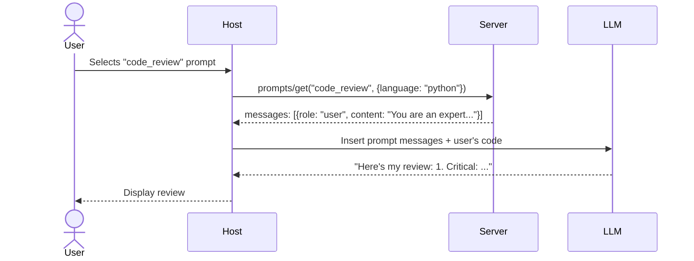

# Chapter 6: Prompts — Reusable Templates for LLMs

## Learning Objectives

By the end of this chapter, you will:

- Understand what MCP prompts are and why they exist
- Know the control hierarchy: Tools (model) vs Resources (app) vs Prompts (user)
- Build prompt templates with dynamic arguments
- Create multi-turn prompts with embedded resources
- Use the `@mcp.prompt()` decorator in Python

---

## What Are Prompts?

**Prompts** are reusable, parameterized templates that servers provide to help users interact with LLMs more effectively. They are pre-built workflows optimized for the server's domain.

| Property | Description |
| :--- | :--- |
| **Controlled by** | The user (user selects which prompt to use) |
| **Purpose** | Provide optimized interaction patterns |
| **Side effects** | None — prompts generate messages for the LLM |
| **Examples** | Code review workflow, SQL explanation, bug report template |

### The Control Hierarchy

MCP's three primitives have a deliberate control hierarchy:

```text
┌─────────────────────────────────────────┐
│  User-Controlled:    PROMPTS            │
│  "I want to use the code review prompt" │
├─────────────────────────────────────────┤
│  App-Controlled:     RESOURCES          │
│  "Show the LLM these files as context"  │
├─────────────────────────────────────────┤
│  Model-Controlled:   TOOLS             │
│  "LLM decides to call run_query()"     │
└─────────────────────────────────────────┘
```

- **Prompts**: The user explicitly selects a prompt from a menu or autocomplete
- **Resources**: The host decides which resources to attach to the conversation
- **Tools**: The LLM autonomously decides which tools to invoke

This hierarchy ensures human oversight at the right levels — users control high-level workflows, while the LLM handles tactical decisions.

---

## Prompt Discovery: `prompts/list`

### List Prompts Request

```json
{
  "jsonrpc": "2.0",
  "id": 1,
  "method": "prompts/list"
}
```

### List Prompts Response

```json
{
  "jsonrpc": "2.0",
  "id": 1,
  "result": {
    "prompts": [
      {
        "name": "code_review",
        "description": "Review code for bugs, style issues, and improvements",
        "arguments": [
          {
            "name": "language",
            "description": "Programming language of the code",
            "required": true
          },
          {
            "name": "focus",
            "description": "What to focus on: bugs, performance, style, or all",
            "required": false
          }
        ]
      },
      {
        "name": "explain_sql",
        "description": "Explain a SQL query step by step",
        "arguments": [
          {
            "name": "query",
            "description": "The SQL query to explain",
            "required": true
          }
        ]
      }
    ]
  }
}
```

### Prompt Definition Fields

| Field | Required | Description |
| :--- | :--- | :--- |
| `name` | Yes | Unique identifier |
| `description` | No | What the prompt does |
| `arguments` | No | List of parameters the prompt accepts |

Each argument has:

| Field | Required | Description |
| :--- | :--- | :--- |
| `name` | Yes | Argument name |
| `description` | No | What the argument does |
| `required` | No | Whether the argument must be provided |

---

## Getting a Prompt: `prompts/get`

When the user selects a prompt, the client fetches it with arguments filled in:

### Get Prompt Request

```json
{
  "jsonrpc": "2.0",
  "id": 2,
  "method": "prompts/get",
  "params": {
    "name": "code_review",
    "arguments": {
      "language": "python",
      "focus": "bugs"
    }
  }
}
```

### Get Prompt Response

```json
{
  "jsonrpc": "2.0",
  "id": 2,
  "result": {
    "description": "Code review for Python (focus: bugs)",
    "messages": [
      {
        "role": "user",
        "content": {
          "type": "text",
          "text": "You are an expert Python code reviewer. Review the following code carefully for bugs, logic errors, and potential runtime issues.\n\nFocus specifically on: bugs\n\nProvide your review in this format:\n1. Issue severity (critical/warning/info)\n2. Line or section affected\n3. Description of the issue\n4. Suggested fix"
        }
      }
    ]
  }
}
```

### How Prompts Are Used

The host takes the returned `messages` array and inserts them into the conversation with the LLM. The user can then continue the conversation naturally:



---

## Multi-Turn Prompts

Prompts can contain **multiple messages** with different roles, setting up a conversation flow:

```json
{
  "messages": [
    {
      "role": "user",
      "content": {
        "type": "text",
        "text": "I have a SQL query that I need help understanding."
      }
    },
    {
      "role": "assistant",
      "content": {
        "type": "text",
        "text": "I'd be happy to help explain your SQL query. Please share it with me, and I'll break it down step by step, explaining each clause and what the overall query does."
      }
    },
    {
      "role": "user",
      "content": {
        "type": "text",
        "text": "Here's the query:\n\nSELECT u.name, COUNT(o.id) as order_count\nFROM users u\nLEFT JOIN orders o ON u.id = o.user_id\nWHERE o.created_at > '2025-01-01'\nGROUP BY u.name\nHAVING COUNT(o.id) > 5\nORDER BY order_count DESC;"
      }
    }
  ]
}
```

Multi-turn prompts can "prime" the assistant with a specific persona or conversation style before the main task.

---

## Prompts with Embedded Resources

Prompts can include **resource references**, pulling in live data as context:

```json
{
  "messages": [
    {
      "role": "user",
      "content": {
        "type": "resource",
        "resource": {
          "uri": "file:///project/src/main.py",
          "mimeType": "text/python",
          "text": "def calculate_total(items):\n    total = 0\n    for item in items:\n        total += item.price\n    return total"
        }
      }
    },
    {
      "role": "user",
      "content": {
        "type": "text",
        "text": "Review this code for potential bugs and performance issues."
      }
    }
  ]
}
```

This combines the resource primitive with the prompt primitive — the prompt fetches a resource and presents it to the LLM in a structured way.

---

## Building Prompts in Python

### Basic Prompt

```python
from mcp.server.mcpserver import MCPServer

mcp = MCPServer("PromptServer")


@mcp.prompt()
def code_review(language: str, focus: str = "all") -> str:
    """Review code for bugs, style issues, and improvements."""
    return f"""You are an expert {language} code reviewer.
Review the following code carefully.

Focus on: {focus}

Provide your review in this format:
1. **Severity**: critical / warning / info
2. **Location**: Line or function affected
3. **Issue**: Description of the problem
4. **Fix**: Suggested improvement with code example"""
```

### Prompt with Multiple Styles

```python
@mcp.prompt()
def explain_concept(topic: str, level: str = "intermediate") -> str:
    """Explain a programming concept at the specified level."""
    level_instructions = {
        "beginner": "Use simple language, real-world analogies, and avoid jargon. Assume no prior programming knowledge.",
        "intermediate": "Use technical terms but explain them. Include code examples. Assume basic programming knowledge.",
        "expert": "Be technical and precise. Use advanced terminology. Compare with alternative approaches.",
    }

    instruction = level_instructions.get(level, level_instructions["intermediate"])

    return f"""Explain the following concept: **{topic}**

Level: {level}
Instructions: {instruction}

Structure your explanation as:
1. What it is (one paragraph)
2. Why it matters
3. How it works (with examples)
4. Common pitfalls
5. Further reading suggestions"""
```

### Prompt with Multi-Turn Messages

You can return a list of messages to simulate a conversation history:

```python
from mcp.server.mcpserver.prompts import base

@mcp.prompt()
def debug_error(error: str) -> list[base.Message]:
    """Create a debugging session for a specific error."""
    return [
        base.UserMessage(f"I'm encountering this error: {error}"),
        base.AssistantMessage("I understand. Can you provide the code snippet that caused this?"),
        base.UserMessage("Here is the code context...")
    ]
```

### Prompt for Database Queries

```python
@mcp.prompt()
def write_sql(task: str, dialect: str = "postgresql") -> str:
    """Help write a SQL query for the given task."""
    return f"""You are a SQL expert working with {dialect}.

Task: {task}

Write a SQL query that accomplishes this task. Include:
1. The SQL query with proper formatting
2. Explanation of each clause
3. Any assumptions about the table schema
4. Performance considerations
5. Alternative approaches if applicable"""
```

### Prompt for Bug Reports

```python
@mcp.prompt()
def bug_report(component: str) -> str:
    """Generate a structured bug report template."""
    return f"""Create a detailed bug report for the **{component}** component.

Use this structure:

## Bug Report: {component}

### Summary
[One-line description]

### Steps to Reproduce
1. [Step 1]
2. [Step 2]
3. [Step 3]

### Expected Behavior
[What should happen]

### Actual Behavior
[What actually happens]

### Environment
- OS:
- Version:
- Browser (if applicable):

### Additional Context
[Screenshots, logs, related issues]"""
```

---

## `listChanged` Notification

If the server's available prompts change (e.g., dynamically generated prompts), it can notify clients:

```json
{
  "jsonrpc": "2.0",
  "method": "notifications/prompts/list_changed"
}
```

The server must declare `"prompts": { "listChanged": true }` in its capabilities.

---

## When to Use Prompts vs Tools vs Resources

| Scenario | Use |
| :--- | :--- |
| User wants to run a specific workflow | **Prompt** |
| LLM needs to execute an action | **Tool** |
| LLM needs data for context | **Resource** |
| User wants to review code with a checklist | **Prompt** (with embedded resources) |
| LLM needs to query a database | **Tool** |
| Display a config file to the LLM | **Resource** |

---

## Exercise: Build a Code Assistant Prompt Server

Create an MCP server with these prompts:

1. **`code_review(language, code_snippet)`** — Reviews code for issues
2. **`refactor(language, pattern)`** — Suggests refactoring using a specific design pattern
3. **`write_tests(language, framework)`** — Generates test cases
4. **`explain_error(error_message, language)`** — Explains an error and suggests fixes
5. **`document_function(language)`** — Generates documentation for a function

**Requirements:**

- Use descriptive arguments with appropriate defaults
- Make the prompts detailed and specific
- Include formatting instructions in each prompt

---

## Summary

- **Prompts** are user-controlled, reusable templates that optimize LLM interactions
- The control hierarchy: **Prompts** (user) → **Resources** (app) → **Tools** (model)
- Discovery via `prompts/list` shows available prompts with their arguments
- `prompts/get` returns a `messages` array ready to inject into a conversation
- Prompts can be **multi-turn** (multiple messages with different roles)
- Prompts can **embed resources** for context injection
- In Python, use `@mcp.prompt()` — the return string becomes the prompt content
- Use `listChanged` notifications for dynamic prompt sets

---

## What's Next

In **Chapter 7**, we'll explore **Transport Mechanisms** — how MCP messages actually travel between clients and servers over stdio, SSE, and Streamable HTTP.
