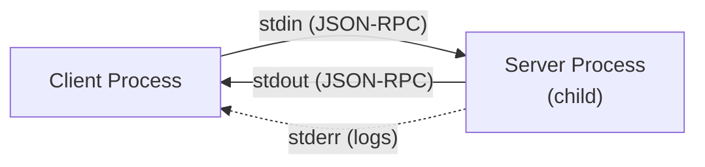
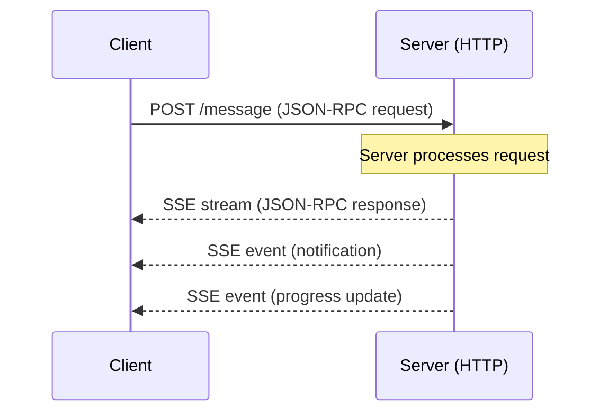
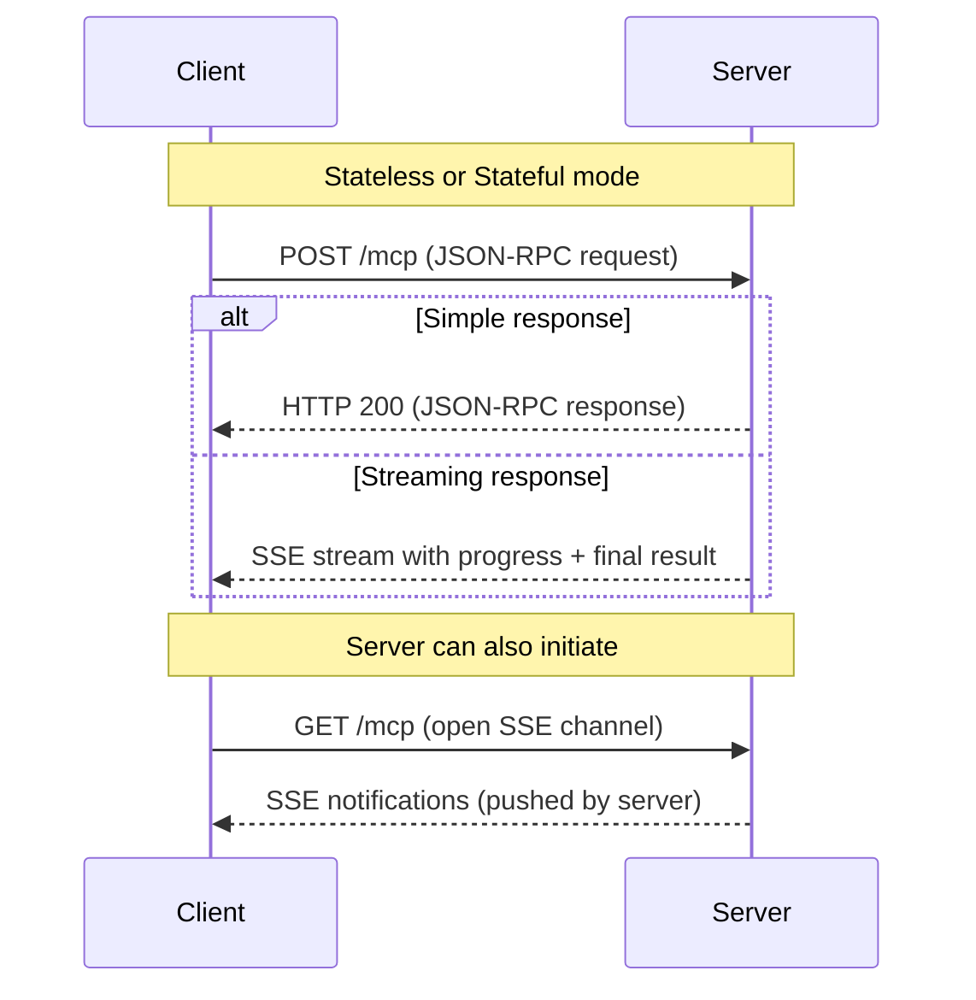
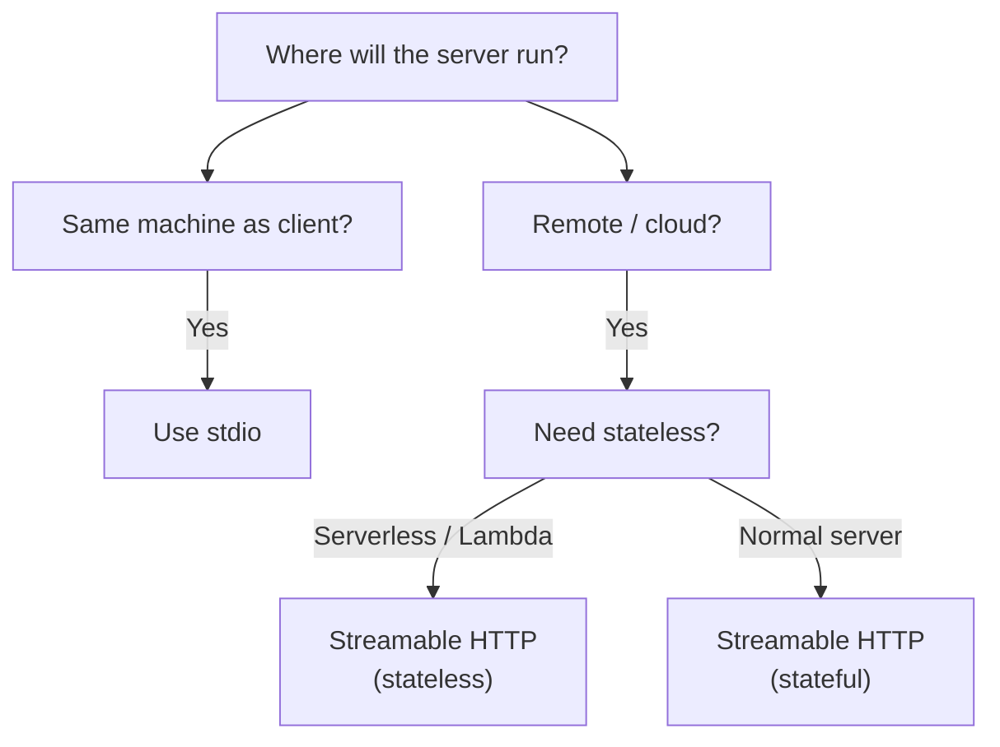

# Chapter 7: Transport Mechanisms — stdio, SSE & Streamable HTTP

## Learning Objectives

By the end of this chapter, you will:

- Understand why MCP separates protocol from transport
- Know the three transport mechanisms and when to use each
- Configure each transport in the Python SDK
- Make informed transport decisions for your use case

---

## Protocol vs Transport

MCP cleanly separates the **protocol** (what messages are sent) from the **transport** (how messages are delivered). This means the same MCP server can work over different transports without changing its logic.

```
┌──────────────────────────────────────┐
│  MCP Protocol (JSON-RPC 2.0)        │
│  tools/list, tools/call, etc.       │
├──────────────────────────────────────┤
│  Transport Layer                     │
│  stdio | SSE | Streamable HTTP       │
└──────────────────────────────────────┘
```

---

## Transport 1: stdio (Standard I/O)

### How It Works

The client spawns the server as a **child process** and communicates via **stdin/stdout**:



- **Client → Server**: Writes JSON-RPC messages to the server's stdin
- **Server → Client**: Writes JSON-RPC messages to stdout
- **Logging**: Server can write debug output to stderr (doesn't interfere with protocol)

### When to Use stdio

| ✅ Great for | ❌ Not for |
|-------------|-----------|
| Local integrations | Remote servers |
| Desktop AI apps (Claude Desktop) | Web applications |
| CLI tools | Multi-client scenarios |
| Development and testing | Cloud deployments |
| Maximum security (no network) | Cross-machine communication |

### Configuration Example (Claude Desktop)

```json
{
  "mcpServers": {
    "my-server": {
      "command": "python",
      "args": ["my_server.py"],
      "env": {
        "API_KEY": "sk-..."
      }
    }
  }
}
```

The host launches `python my_server.py` and pipes stdin/stdout for communication.

### Python SDK: Running with stdio

```python
from mcp.server.mcpserver import MCPServer

mcp = MCPServer("MyServer")

@mcp.tool()
def hello(name: str) -> str:
    """Say hello."""
    return f"Hello, {name}!"

if __name__ == "__main__":
    mcp.run(transport="stdio")
```

### Key Properties of stdio

| Property | Value |
|----------|-------|
| **Latency** | Very low (no network) |
| **Security** | High (no network exposure) |
| **Setup** | Simple (just run a process) |
| **Scalability** | Single client only |
| **Statefulness** | Stateful (process lifetime = session) |

---

## Transport 2: SSE (Server-Sent Events)

### How It Works

SSE uses **HTTP** with a persistent connection for server-to-client streaming:



- **Client → Server**: HTTP POST requests with JSON-RPC body
- **Server → Client**: Server-Sent Events stream for responses and notifications
- The SSE connection stays open for real-time push from server to client

### When to Use SSE

| ✅ Great for | ❌ Not for |
|-------------|-----------|
| Web-based AI applications | Two-way streaming |
| Browser clients | Very high throughput |
| Simple remote access | Complex stateful sessions |
| Streaming responses | Bi-directional notification-heavy workflows |

> **Note**: SSE is being superseded by Streamable HTTP in newer implementations. It remains supported but is no longer the recommended transport for new servers.

### Python SDK: Running with SSE

```python
if __name__ == "__main__":
    mcp.run(transport="sse", host="0.0.0.0", port=8000)
```

---

## Transport 3: Streamable HTTP (Recommended)

### How It Works

Streamable HTTP is the **modern, recommended transport** for remote MCP servers. It uses standard HTTP with optional streaming support:



### Two Modes

**Stateful Mode** (default):

- Server maintains session state
- Uses `Mcp-Session-Id` header to track sessions
- Supports full bidirectional communication

**Stateless Mode**:

- Each request is independent
- No session tracking
- Better for serverless/cloud deployments

### When to Use Streamable HTTP

| ✅ Great for | ❌ Not for |
|-------------|-----------|
| Production remote servers | Extremely simple local tools |
| Cloud deployments | When stdio is sufficient |
| Scalable multi-client setups | |
| Serverless functions (stateless mode) | |
| Web and mobile clients | |

### Python SDK: Running with Streamable HTTP

```python
# Stateful (default)
if __name__ == "__main__":
    mcp.run(transport="streamable-http", host="0.0.0.0", port=8000)
```

```python
# Stateless (for serverless / cloud)
if __name__ == "__main__":
    mcp.run(
        transport="streamable-http",
        host="0.0.0.0",
        port=8000,
        stateless_http=True
    )
```

### Key Properties of Streamable HTTP

| Property | Value |
|----------|-------|
| **Latency** | Low (HTTP) |
| **Security** | HTTPS + authentication support |
| **Setup** | Moderate (HTTP server) |
| **Scalability** | High (standard HTTP infrastructure) |
| **Statefulness** | Configurable (stateful or stateless) |
| **Streaming** | Yes (SSE within HTTP) |

---

## Transport Comparison

| Feature | stdio | SSE | Streamable HTTP |
|---------|-------|-----|-----------------|
| **Location** | Local only | Remote | Remote |
| **Network required** | No | Yes | Yes |
| **Multi-client** | No | Yes | Yes |
| **Bidirectional** | Yes | Limited | Yes |
| **Streaming** | No | Yes | Yes |
| **Stateless option** | No | No | Yes |
| **Auth support** | N/A (local) | HTTP auth | HTTP auth + OAuth |
| **Production ready** | ✓ (local) | ✓ | ✓✓ (recommended) |
| **Best for** | Desktop apps | Web apps | Everything remote |

---

## Decision Matrix

Use this flowchart to choose the right transport:



**Quick Rules:**

1. **Local desktop integration** → stdio
2. **Remote server** → Streamable HTTP
3. **Serverless deployment** → Streamable HTTP (stateless)
4. **Legacy web integration** → SSE (but prefer Streamable HTTP)

---

## Transport Configuration in Python

### Full Server with Transport Options

```python
from mcp.server.mcpserver import MCPServer

mcp = MCPServer("FlexibleServer")


@mcp.tool()
def greet(name: str) -> str:
    """Greet someone by name."""
    return f"Hello, {name}!"


if __name__ == "__main__":
    import sys

    transport = sys.argv[1] if len(sys.argv) > 1 else "stdio"

    if transport == "stdio":
        mcp.run(transport="stdio")
    elif transport == "http":
        mcp.run(
            transport="streamable-http",
            host="0.0.0.0",
            port=8000
        )
    elif transport == "sse":
        mcp.run(
            transport="sse",
            host="0.0.0.0",
            port=8000
        )
    else:
        print(f"Unknown transport: {transport}")
        sys.exit(1)
```

Usage:

```bash
python server.py stdio          # Local mode
python server.py http           # Remote mode
python server.py sse            # SSE mode
```

---

## Security Considerations by Transport

| Transport | Threat Surface | Mitigations |
|-----------|---------------|-------------|
| **stdio** | Minimal (local process) | OS-level process isolation |
| **SSE** | Network exposure | HTTPS, authentication, firewall rules |
| **Streamable HTTP** | Network exposure | HTTPS, OAuth 2.0, rate limiting, CORS |

### Streamable HTTP Security Checklist

- [ ] Use HTTPS in production
- [ ] Implement authentication (OAuth 2.0 or API keys)
- [ ] Set CORS policies for browser clients
- [ ] Rate-limit requests
- [ ] Validate session IDs (stateful mode)
- [ ] Log all tool invocations for audit

---

## Summary

- MCP separates **protocol** from **transport** — same server logic, different delivery
- **stdio**: Local, fast, secure — ideal for desktop apps and development
- **SSE**: HTTP-based streaming — good for web apps, being superseded
- **Streamable HTTP**: The modern default — supports stateful and stateless modes
- Choose transport based on: **location** (local vs remote), **scale** (single vs multi-client), **deployment** (server vs serverless)
- All transports carry the same JSON-RPC 2.0 messages
- Security requirements scale with network exposure

---

## What's Next

In **Chapter 8**, we'll put everything together and **build a complete MCP server** from scratch — with tools, resources, prompts, and proper transport configuration.
