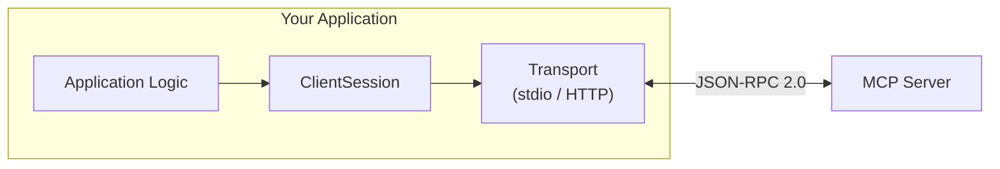

# Chapter 9: Building an MCP Client (Python)

## Learning Objectives

By the end of this chapter, you will:

- Connect to MCP servers programmatically using the Python SDK
- Use both stdio and HTTP transports from the client side
- List and invoke tools, read resources, and get prompts
- Build a simple CLI application that talks to MCP servers
- Handle errors and structured output in client code

---

## Why Build a Client?

So far we've used MCP Inspector and Claude Desktop as clients. But sometimes you need to:

- Build a **custom AI application** that connects to MCP servers
- Create **automated pipelines** that use MCP tools
- Write **integration tests** for your servers
- Build a **CLI tool** that interacts with MCP services

The MCP Python SDK provides a full client library for all of these.

---

## Client Architecture



The key classes:

| Class | Purpose |
|-------|---------|
| `StdioServerParameters` | Configures how to launch a stdio server |
| `stdio_client` | Creates a stdio transport connection |
| `streamablehttp_client` | Creates an HTTP transport connection |
| `ClientSession` | Manages the MCP session (initialize, tools, resources, prompts) |

---

## Connecting via stdio

The most common pattern — launch a server as a child process and communicate via stdin/stdout.

### Basic stdio Client

```python
import asyncio

from mcp import ClientSession, StdioServerParameters
from mcp.client.stdio import stdio_client


async def main():
    # Define how to launch the server
    server_params = StdioServerParameters(
        command="python",
        args=["server.py"],
    )

    # Connect to the server
    async with stdio_client(server_params) as (read, write):
        async with ClientSession(read, write) as session:
            # Initialize the connection (required!)
            await session.initialize()

            # Now you can interact with the server
            print("Connected to server!")

            # List available tools
            tools_result = await session.list_tools()
            for tool in tools_result.tools:
                print(f"  Tool: {tool.name} — {tool.description}")


if __name__ == "__main__":
    asyncio.run(main())
```

### Key Points

1. **`stdio_client`** launches the server process and sets up stdin/stdout pipes
2. **`ClientSession`** wraps the transport with MCP protocol logic
3. **`session.initialize()`** performs the handshake — **this must be called first**
4. Everything is **async** — use `asyncio.run()` to execute

### Using `uv` as the Command

If your server uses `uv`, adjust the parameters:

```python
server_params = StdioServerParameters(
    command="uv",
    args=["--directory", "/path/to/server", "run", "server.py"],
)
```

### Passing Environment Variables

```python
server_params = StdioServerParameters(
    command="python",
    args=["server.py"],
    env={
        "API_KEY": "sk-...",
        "DATABASE_URL": "postgresql://localhost/mydb",
    },
)
```

---

## Connecting via Streamable HTTP

For remote servers running on HTTP:

```python
import asyncio

from mcp import ClientSession
from mcp.client.streamable_http import streamablehttp_client


async def main():
    # Connect to an HTTP server
    async with streamablehttp_client("http://localhost:8000/mcp") as (
        read, write, _
    ):
        async with ClientSession(read, write) as session:
            await session.initialize()
            print("Connected via HTTP!")

            tools_result = await session.list_tools()
            for tool in tools_result.tools:
                print(f"  Tool: {tool.name}")


if __name__ == "__main__":
    asyncio.run(main())
```

---

## Listing and Calling Tools

### List All Tools

```python
tools_result = await session.list_tools()

for tool in tools_result.tools:
    print(f"Tool: {tool.name}")
    print(f"  Description: {tool.description}")
    print(f"  Schema: {tool.inputSchema}")
    print()
```

### Call a Tool

```python
from mcp import types

# Call the 'get_weather' tool
result = await session.call_tool(
    "get_weather",
    arguments={"city": "London"}
)

# Process the result
if result.isError:
    print(f"Error: {result.content[0].text}")
else:
    for content in result.content:
        if isinstance(content, types.TextContent):
            print(f"Result: {content.text}")
        elif isinstance(content, types.ImageContent):
            print(f"Image: {content.mimeType}, {len(content.data)} bytes")

# Check for structured output
if result.structuredContent:
    print(f"Structured: {result.structuredContent}")
```

### Handle Errors Gracefully

```python
async def safe_tool_call(session, tool_name: str, arguments: dict) -> str:
    """Call a tool with error handling."""
    try:
        result = await session.call_tool(tool_name, arguments=arguments)

        if result.isError:
            error_text = result.content[0].text if result.content else "Unknown error"
            return f"Tool error: {error_text}"

        texts = []
        for content in result.content:
            if isinstance(content, types.TextContent):
                texts.append(content.text)
        return "\n".join(texts) if texts else "No output"

    except Exception as e:
        return f"Connection error: {e}"
```

---

## Listing and Reading Resources

### List Resources

```python
resources_result = await session.list_resources()

for resource in resources_result.resources:
    print(f"Resource: {resource.uri}")
    print(f"  Name: {resource.name}")
    print(f"  MIME: {resource.mimeType}")
    print()
```

### Read a Resource

```python
content = await session.read_resource("weather://cities")

for item in content.contents:
    if isinstance(item, types.TextContent):
        print(f"Content: {item.text}")
    elif isinstance(item, types.BlobContent):
        print(f"Binary data: {len(item.blob)} bytes")
```

### Read a Templated Resource

```python
# The URI includes the template variable filled in
content = await session.read_resource("weather://city/tokyo")

for item in content.contents:
    if isinstance(item, types.TextContent):
        print(item.text)
```

---

## Listing and Getting Prompts

### List Prompts

```python
prompts_result = await session.list_prompts()

for prompt in prompts_result.prompts:
    print(f"Prompt: {prompt.name}")
    print(f"  Description: {prompt.description}")
    if prompt.arguments:
        for arg in prompt.arguments:
            req = "required" if arg.required else "optional"
            print(f"  Arg: {arg.name} ({req}) — {arg.description}")
    print()
```

### Get a Prompt

```python
prompt_result = await session.get_prompt(
    "weather_report",
    arguments={"city": "Tokyo"}
)

print(f"Description: {prompt_result.description}")
for message in prompt_result.messages:
    print(f"[{message.role}]: {message.content.text}")
```

---

## Building a CLI Client

Here's a complete interactive CLI that connects to any MCP server:

```python
"""
MCP CLI Client
==============
An interactive command-line client for MCP servers.

Usage:
    python client.py server.py                    # stdio
    python client.py --http http://localhost:8000  # HTTP
"""

import asyncio
import json
import sys

from mcp import ClientSession, StdioServerParameters, types
from mcp.client.stdio import stdio_client


async def run_cli(session: ClientSession):
    """Interactive CLI loop."""
    print("\n" + "=" * 50)
    print("MCP Client — Interactive Mode")
    print("=" * 50)
    print("Commands: tools, call <name> <json_args>, resources,")
    print("          read <uri>, prompts, get <name> <json_args>,")
    print("          quit")
    print("=" * 50 + "\n")

    while True:
        try:
            user_input = input("mcp> ").strip()
        except (EOFError, KeyboardInterrupt):
            break

        if not user_input:
            continue

        parts = user_input.split(maxsplit=2)
        command = parts[0].lower()

        if command == "quit":
            break

        elif command == "tools":
            result = await session.list_tools()
            if not result.tools:
                print("No tools available.")
            for tool in result.tools:
                print(f"  🔧 {tool.name}: {tool.description}")
            print()

        elif command == "call" and len(parts) >= 2:
            tool_name = parts[1]
            args = json.loads(parts[2]) if len(parts) > 2 else {}
            try:
                result = await session.call_tool(tool_name, arguments=args)
                if result.isError:
                    print(f"  ❌ Error: {result.content[0].text}")
                else:
                    for content in result.content:
                        if isinstance(content, types.TextContent):
                            print(f"  ✅ {content.text}")
            except Exception as e:
                print(f"  ❌ {e}")
            print()

        elif command == "resources":
            result = await session.list_resources()
            if not result.resources:
                print("No resources available.")
            for r in result.resources:
                print(f"  📄 {r.uri} — {r.name}")
            print()

        elif command == "read" and len(parts) >= 2:
            uri = parts[1]
            try:
                result = await session.read_resource(uri)
                for item in result.contents:
                    if isinstance(item, types.TextContent):
                        print(f"  📄 {item.text}")
            except Exception as e:
                print(f"  ❌ {e}")
            print()

        elif command == "prompts":
            result = await session.list_prompts()
            if not result.prompts:
                print("No prompts available.")
            for p in result.prompts:
                args_str = ""
                if p.arguments:
                    args_str = ", ".join(a.name for a in p.arguments)
                print(f"  💬 {p.name}({args_str}): {p.description}")
            print()

        elif command == "get" and len(parts) >= 2:
            prompt_name = parts[1]
            args = json.loads(parts[2]) if len(parts) > 2 else {}
            try:
                result = await session.get_prompt(prompt_name, arguments=args)
                for msg in result.messages:
                    role = msg.role.upper()
                    text = msg.content.text if hasattr(msg.content, 'text') else str(msg.content)
                    print(f"  [{role}]: {text[:200]}...")
            except Exception as e:
                print(f"  ❌ {e}")
            print()

        else:
            print("Unknown command. Type 'tools', 'call', 'resources', 'read', 'prompts', 'get', or 'quit'.")
            print()


async def main():
    if len(sys.argv) < 2:
        print("Usage:")
        print("  python client.py <server_script.py>")
        print("  python client.py --http <url>")
        sys.exit(1)

    if sys.argv[1] == "--http":
        from mcp.client.streamable_http import streamablehttp_client

        url = sys.argv[2]
        async with streamablehttp_client(url) as (read, write, _):
            async with ClientSession(read, write) as session:
                await session.initialize()
                print(f"Connected to {url}")
                await run_cli(session)
    else:
        server_script = sys.argv[1]
        server_params = StdioServerParameters(
            command="python",
            args=[server_script],
        )
        async with stdio_client(server_params) as (read, write):
            async with ClientSession(read, write) as session:
                await session.initialize()
                print(f"Connected to {server_script}")
                await run_cli(session)


if __name__ == "__main__":
    asyncio.run(main())
```

### Usage Examples

```bash
# Connect to a local server via stdio
python client.py server.py

# Connect to a remote server via HTTP
python client.py --http http://localhost:8000/mcp
```

### Example Session

```
Connected to server.py

==================================================
MCP Client — Interactive Mode
==================================================
Commands: tools, call <name> <json_args>, resources,
          read <uri>, prompts, get <name> <json_args>,
          quit
==================================================

mcp> tools
  🔧 get_weather: Get current weather conditions for a city.
  🔧 get_forecast: Get a multi-day weather forecast for a city.
  🔧 compare_weather: Compare weather between multiple cities.

mcp> call get_weather {"city": "Tokyo"}
  ✅ {
    "city": "Tokyo",
    "temperature": 28,
    "condition": "Partly Cloudy",
    ...
  }

mcp> resources
  📄 weather://cities — List all cities with available weather data.
  📄 weather://about — Information about this weather server.

mcp> read weather://cities
  📄 {"supported_cities": ["London", "New York", "Tokyo", "Mumbai", "Sydney"], "total": 5}

mcp> prompts
  💬 weather_report(city): Generate a detailed weather report for a city.
  💬 travel_comparison(cities): Compare weather between cities for travel planning.

mcp> quit
```

---

## Exercise: Write an Automated Test Client

Create a test client that:

1. Connects to the weather server from Chapter 8
2. Runs through **all tools** with valid and invalid arguments
3. Reads **all resources** and verifies they return data
4. Gets **all prompts** and checks they return messages
5. Prints a **test report**: `PASS / FAIL` for each test case

This is essentially an integration test suite for your MCP server.

---

## Summary

- Use `stdio_client` + `ClientSession` for local server connections
- Use `streamablehttp_client` + `ClientSession` for remote HTTP servers
- Always call `session.initialize()` before any other operations
- `list_tools()`, `call_tool()`, `list_resources()`, `read_resource()`, `list_prompts()`, `get_prompt()` are your core operations
- Handle errors at both the tool level (`isError`) and protocol level (exceptions)
- Check `structuredContent` for machine-readable results alongside text

---

## What's Next

In **Chapter 10**, we'll explore the advanced primitives: **Sampling** (server-initiated LLM requests) and **Elicitation** (server-initiated user input).
