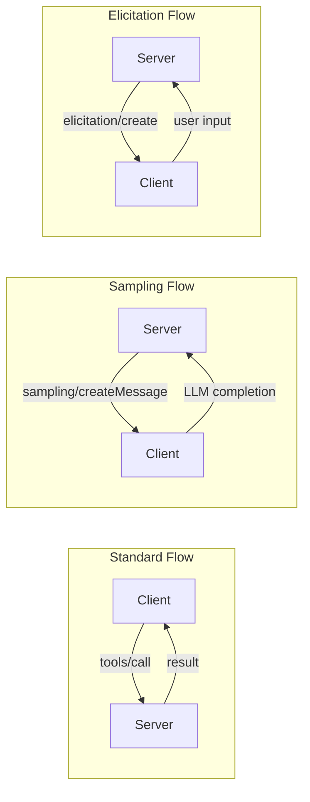
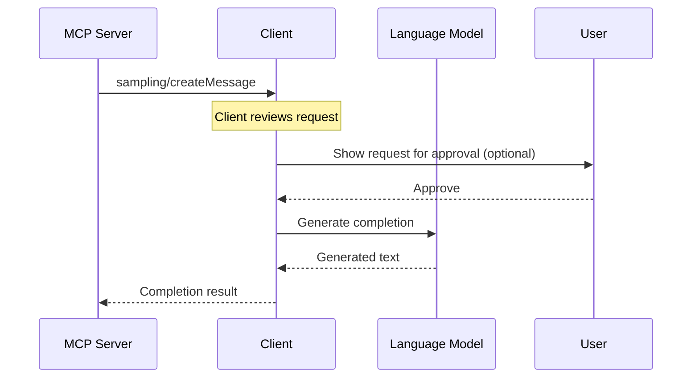
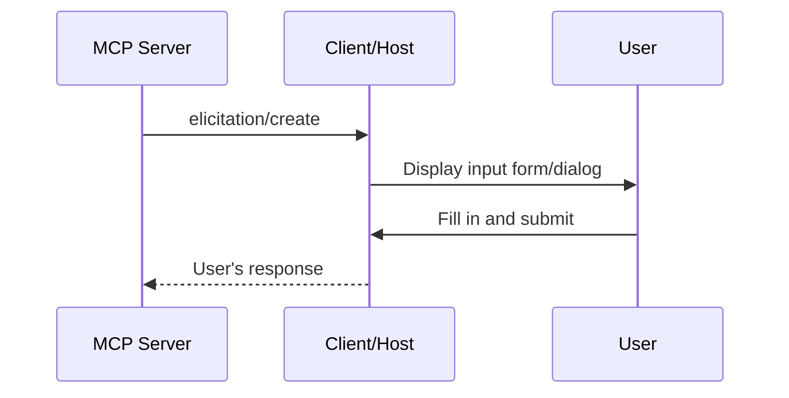
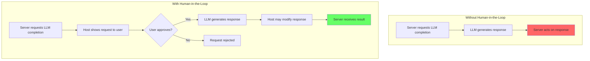
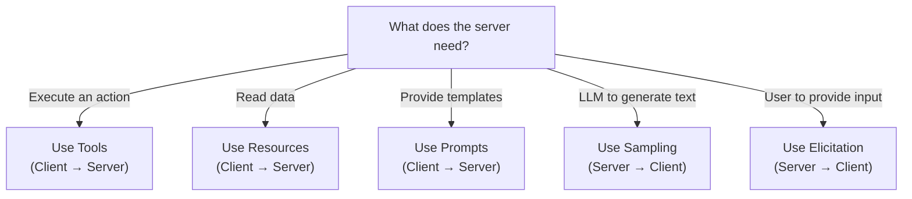

# Chapter 10: Sampling & Elicitation — Advanced Primitives

## Learning Objectives

By the end of this chapter, you will:

- Understand **sampling** — how servers request LLM completions
- Understand **elicitation** — how servers request user input
- Know the security model and human-in-the-loop principles
- See when and why to use these advanced features

---

## Beyond Request-Response

In Chapters 4-6, we saw the standard MCP flow: **client → server**. The client asks, the server answers.

But some workflows require the reverse:

- A server needs the **LLM to generate text** (e.g., summarize data before storing it)
- A server needs **user confirmation** before performing a destructive action

MCP's advanced primitives enable this:



---

## Sampling: Server → LLM

### What Is Sampling?

**Sampling** allows an MCP server to request an LLM completion through the client. The server sends a prompt, and the client routes it to the LLM and returns the result.



### Why Does This Exist?

Sampling enables **agentic server behavior**. Instead of just responding to tool calls, servers can:

| Use Case | How Sampling Helps |
| :--- | :--- |
| **Data summarization** | Server fetches data, asks LLM to summarize before returning |
| **Content generation** | Server asks LLM to generate content based on retrieved context |
| **Multi-step workflows** | Server orchestrates stages, using LLM between each step |
| **Classification** | Server asks LLM to classify input before routing |
| **Translation** | Server asks LLM to translate content as part of processing |

### Sampling Request

```json
{
  "jsonrpc": "2.0",
  "id": 1,
  "method": "sampling/createMessage",
  "params": {
    "messages": [
      {
        "role": "user",
        "content": {
          "type": "text",
          "text": "Summarize this database query result in 2 sentences:\n\nTotal users: 1,247\nNew users (30d): 89\nActive users (7d): 523\nChurn rate: 3.2%"
        }
      }
    ],
    "maxTokens": 100,
    "systemPrompt": "You are a data analyst. Be concise and insightful.",
    "temperature": 0.3
  }
}
```

### Sampling Response

```json
{
  "jsonrpc": "2.0",
  "id": 1,
  "result": {
    "role": "assistant",
    "content": {
      "type": "text",
      "text": "The platform has 1,247 total users with steady growth (89 new in 30 days). Engagement is healthy with 42% weekly active users, though the 3.2% churn rate warrants attention."
    },
    "model": "claude-3-5-sonnet-20241022"
  }
}
```

### Request Parameters

| Field | Required | Description |
| :--- | :--- | :--- |
| `messages` | Yes | Conversation messages to send to the LLM |
| `maxTokens` | Yes | Maximum tokens in the completion |
| `systemPrompt` | No | System prompt for the LLM |
| `temperature` | No | Sampling temperature (0.0 — 1.0) |
| `modelPreferences` | No | Hints about which model to use |
| `includeContext` | No | Whether to include conversation context |
| `metadata` | No | Additional metadata for the request |

### Sampling Capabilities

For sampling to work:

1. **Client** must declare `"sampling": {}` during initialization
2. **Server** can then send `sampling/createMessage` requests

If the client doesn't support sampling, the server must not attempt it.

### Python Example: Data Summarization

Here is how to request a completion from inside a tool:

```python
from mcp.server.mcpserver import MCPServer
from mcp.types import UserMessage, TextContent

mcp = MCPServer("Analyst")

@mcp.tool()
async def summarize_data(data: str) -> str:
    """Summarize raw data using the LLM."""
    
    # Request sampling from the host
    result = await mcp.get_context().session.create_message(
        messages=[
            UserMessage(
                content=TextContent(
                    type="text",
                    text=f"Summarize this data in 1 sentence: {data}"
                )
            )
        ],
        max_tokens=100,
        temperature=0.5
    )
    
    # Return the LLM's response
    return result.content.text
```

---

## Elicitation: Server → User

### What Is Elicitation?

**Elicitation** allows servers to request **direct input from the user**. This is different from sampling (which asks the LLM). Elicitation asks the human.



### Use Cases

| Scenario | What the Server Asks |
| :--- | :--- |
| **Destructive action** | "Are you sure you want to delete all records?" |
| **Missing info** | "Which database should I connect to?" |
| **Configuration** | "Enter your API key for this service" |
| **Ambiguity** | "Did you mean 'users' table or 'user_profiles' table?" |
| **Authentication** | "Please enter your 2FA code" |

### Elicitation Request

```json
{
  "jsonrpc": "2.0",
  "id": 2,
  "method": "elicitation/create",
  "params": {
    "message": "This will delete 1,247 user records. Are you sure?",
    "requestedSchema": {
      "type": "object",
      "properties": {
        "confirm": {
          "type": "boolean",
          "description": "Confirm deletion"
        },
        "reason": {
          "type": "string",
          "description": "Reason for deletion (optional)"
        }
      },
      "required": ["confirm"]
    }
  }
}
```

### Elicitation Response

```json
{
  "jsonrpc": "2.0",
  "id": 2,
  "result": {
    "action": "accept",
    "content": {
      "confirm": true,
      "reason": "Cleaning up test data"
    }
  }
}
```

### Response Actions

| Action | Meaning |
| :--- | :--- |
| `"accept"` | User provided input (check `content`) |
| `"decline"` | User declined to respond |
| `"cancel"` | User cancelled the operation |

### Elicitation Capabilities

For elicitation to work:

1. **Client** must declare `"elicitation": {}` during initialization
2. **Server** can then send `elicitation/create` requests
3. **Host** must display a UI for the user to respond

---

## The Human-in-the-Loop Principle

Both sampling and elicitation follow MCP's core security principle: **humans must remain in control**.



### Key Principles

1. **User consent**: The host **should** present sampling requests to the user for approval
2. **Modification rights**: The host **may** modify the LLM's response before returning it
3. **No direct access**: Servers never interact directly with the LLM — always through the host
4. **Transparency**: The user should be aware that a server is requesting LLM completions
5. **Privacy**: Servers should not use sampling to extract information the user hasn't shared

---

## When to Use Each Primitive



### Decision Matrix

| Need | Primitive | Direction |
| :--- | :--- | :--- |
| Server needs to execute code | Tool | Client → Server |
| LLM needs context data | Resource | Client → Server |
| User wants a workflow template | Prompt | Client → Server |
| Server needs LLM to generate/analyze | Sampling | Server → Client |
| Server needs user confirmation/input | Elicitation | Server → Client |

---

## Practical Example: Smart Database Server

Here's a conceptual example combining all primitives:

```text
User: "Clean up the users table — remove all inactive accounts"

Flow:
1. [Tool] Server runs SQL to count inactive accounts
   → Result: "Found 847 inactive accounts"

2. [Sampling] Server asks LLM to classify risk
   → LLM: "This is a high-risk bulk deletion affecting 68% of accounts"

3. [Elicitation] Server asks user for confirmation
   → Dialog: "Delete 847 accounts (68% of total)? This cannot be undone."
   → User: "Yes, confirmed"

4. [Tool] Server executes DELETE query
   → Result: "847 accounts removed"

5. [Sampling] Server asks LLM to generate audit log entry
   → LLM: "Bulk deletion of 847 inactive user accounts..."
```

This combines all five primitives in a single workflow, with human oversight at critical points.

---

## Current Limitations

| Limitation | Detail |
| :--- | :--- |
| **Client support** | Not all hosts support sampling and elicitation yet |
| **UI dependency** | Elicitation requires the host to have UI capabilities |
| **No guarantees** | Hosts can modify, delay, or reject requests |
| **Model control** | Servers can hint at model preferences but can't force them |
| **Security review** | These features are still evolving in the spec |

---

## Summary

- **Sampling** lets servers request LLM completions — enabling agentic, multi-step server workflows
- **Elicitation** lets servers request user input — for confirmations, missing data, and disambiguation
- Both require **client capability declarations** during initialization
- The **human-in-the-loop** principle ensures users maintain control
- Hosts can **approve, modify, or reject** sampling and elicitation requests
- Use sampling for **AI-assisted server logic**; use elicitation for **human decision points**

---

## What's Next

In **Chapter 11**, we'll cover **Security, Authentication & Best Practices** — protecting your MCP servers in production.
