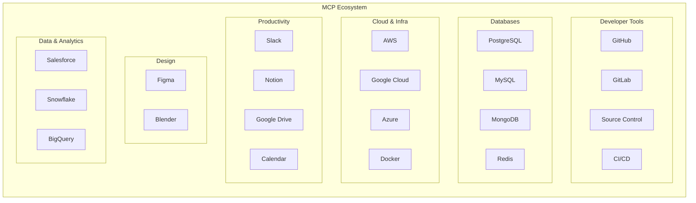

# Chapter 12: Real-World MCP Servers & Ecosystem

## Learning Objectives

By the end of this chapter, you will:

- Know the most popular production MCP servers and what they do
- Understand how to find and evaluate community servers
- Analyze the anatomy of a production-quality MCP server
- See how major companies are adopting MCP

---

## The MCP Ecosystem Landscape

Since its launch in November 2024, the MCP ecosystem has grown explosively. As of 2026, there are thousands of MCP servers covering virtually every category of external integration.



---

## Popular MCP Servers

### Developer Tools

| Server | What It Does | Key Tools |
|--------|-------------|-----------|
| **GitHub** | Repository management, code search, issues, PRs | `create_issue`, `search_code`, `get_file_contents`, `create_pull_request` |
| **GitLab** | Similar to GitHub for GitLab-hosted repos | `create_merge_request`, `list_pipelines`, `get_project` |
| **Filesystem** | Read/write local files and directories | `read_file`, `write_file`, `list_directory`, `search_files` |
| **Git** | Git operations on local repositories | `git_log`, `git_diff`, `git_status`, `git_commit` |

### Databases

| Server | What It Does | Key Tools |
|--------|-------------|-----------|
| **PostgreSQL** | Execute SQL queries, inspect schemas | `run_query`, `list_tables`, `describe_table` |
| **SQLite** | Lightweight database access | `query`, `execute`, `list_tables` |
| **MongoDB** | Document database operations | `find`, `insert`, `aggregate` |
| **Redis** | Key-value store operations | `get`, `set`, `keys`, `info` |

### Productivity & Communication

| Server | What It Does | Key Tools |
|--------|-------------|-----------|
| **Slack** | Send messages, manage channels | `post_message`, `list_channels`, `search_messages` |
| **Notion** | Page and database management | `create_page`, `query_database`, `search` |
| **Google Drive** | File management and search | `list_files`, `read_file`, `search_files` |
| **Google Calendar** | Event management | `list_events`, `create_event`, `find_free_time` |

### Cloud & Infrastructure

| Server | What It Does | Key Tools |
|--------|-------------|-----------|
| **AWS** | Cloud resource management | `list_instances`, `describe_service`, `get_logs` |
| **Docker** | Container management | `list_containers`, `run_container`, `view_logs` |
| **Kubernetes** | Cluster operations | `get_pods`, `describe_deployment`, `view_logs` |

### Design & Creative

| Server | What It Does | Key Tools |
|--------|-------------|-----------|
| **Figma** | Design file access and manipulation | `get_file`, `list_components`, `export_frame` |
| **Blender** | 3D model manipulation | `create_object`, `render_scene`, `modify_mesh` |

---

## Finding MCP Servers

### Official Sources

| Source | URL | Description |
|--------|-----|-------------|
| **MCP Server Registry** | [modelcontextprotocol.io/servers](https://modelcontextprotocol.io) | Official curated list |
| **GitHub Topics** | `github.com/topics/mcp-server` | Community-tagged repos |
| **npm Registry** | Search `@modelcontextprotocol/server-*` | Official npm packages |
| **PyPI** | Search `mcp-server-*` | Python packages |

### Evaluating a Server

Before connecting a third-party MCP server, evaluate it:

| Criteria | What to Check |
|----------|--------------|
| **Source** | Is it from a known organization or individual? |
| **Stars/Downloads** | Does it have community adoption? |
| **Last updated** | Is it actively maintained? |
| **License** | Is the license compatible with your use? |
| **Code review** | Have you reviewed the source code for security? |
| **Tools exposed** | Are the tools reasonable for its stated purpose? |
| **Permissions** | Does it request excessive access? |
| **Dependencies** | Are dependencies minimal and well-known? |

### Red Flags 🚩

- Server requests permissions beyond its stated purpose
- Minified or obfuscated source code
- Excessive outbound network calls
- Tool descriptions with unusual instructions
- No documentation or examples
- Very new with no community reviews

---

## Anatomy of a Production Server

Let's examine what makes a server production-quality, using the GitHub MCP server as a case study.

### Project Structure

```
github-mcp-server/
├── src/
│   ├── server.py          # Main server definition
│   ├── tools/
│   │   ├── repos.py       # Repository tools
│   │   ├── issues.py      # Issue tools
│   │   ├── prs.py         # Pull request tools
│   │   └── search.py      # Search tools
│   ├── resources/
│   │   ├── files.py       # File content resources
│   │   └── readme.py      # README resources
│   ├── auth.py            # Authentication handling
│   └── config.py          # Configuration management
├── tests/
│   ├── test_tools.py
│   ├── test_resources.py
│   └── test_integration.py
├── pyproject.toml
├── README.md
├── LICENSE
└── Dockerfile
```

### Production Patterns

**1. Modular Tool Organization**

Instead of one giant file, tools are organized by domain:

```python
# tools/repos.py
from mcp.server.mcpserver import MCPServer


def register_repo_tools(mcp: MCPServer) -> None:
    """Register all repository-related tools."""

    @mcp.tool()
    async def list_repos(org: str, limit: int = 30) -> str:
        """List repositories in an organization."""
        # ...

    @mcp.tool()
    async def get_repo(owner: str, repo: str) -> str:
        """Get repository details."""
        # ...
```

```python
# server.py
from mcp.server.mcpserver import MCPServer
from tools.repos import register_repo_tools
from tools.issues import register_issue_tools

mcp = MCPServer("GitHub")
register_repo_tools(mcp)
register_issue_tools(mcp)
```

**2. Configuration via Environment Variables**

```python
# config.py
import os
from dataclasses import dataclass


@dataclass
class Config:
    github_token: str
    api_base_url: str = "https://api.github.com"
    max_results: int = 100
    timeout_seconds: int = 30

    @classmethod
    def from_env(cls) -> "Config":
        token = os.environ.get("GITHUB_TOKEN")
        if not token:
            raise RuntimeError(
                "GITHUB_TOKEN environment variable is required"
            )
        return cls(
            github_token=token,
            api_base_url=os.environ.get("GITHUB_API_URL", cls.api_base_url),
            max_results=int(os.environ.get("MAX_RESULTS", cls.max_results)),
        )
```

**3. Proper Error Handling**

```python
import httpx


@mcp.tool()
async def get_issue(owner: str, repo: str, number: int) -> str:
    """Get a GitHub issue by number."""
    try:
        async with httpx.AsyncClient() as client:
            response = await client.get(
                f"{config.api_base_url}/repos/{owner}/{repo}/issues/{number}",
                headers={"Authorization": f"Bearer {config.github_token}"},
                timeout=config.timeout_seconds,
            )
            response.raise_for_status()
            return response.text

    except httpx.HTTPStatusError as e:
        if e.response.status_code == 404:
            raise ValueError(
                f"Issue #{number} not found in {owner}/{repo}"
            )
        elif e.response.status_code == 403:
            raise ValueError(
                "Rate limit exceeded or insufficient permissions"
            )
        raise ValueError(f"GitHub API error: {e.response.status_code}")

    except httpx.TimeoutException:
        raise ValueError(
            f"Request timed out after {config.timeout_seconds}s"
        )
```

**4. Comprehensive Testing**

```python
# tests/test_tools.py
import pytest
from unittest.mock import AsyncMock, patch


@pytest.mark.asyncio
async def test_get_issue_success():
    """Test successful issue retrieval."""
    mock_response = {
        "number": 42,
        "title": "Fix login bug",
        "state": "open",
    }
    # ... test implementation


@pytest.mark.asyncio
async def test_get_issue_not_found():
    """Test 404 handling."""
    # ... test that ValueError is raised with helpful message


@pytest.mark.asyncio
async def test_get_issue_rate_limited():
    """Test rate limit handling."""
    # ... test 403 response handling
```

---

## Industry Adoption

### Who's Using MCP?

| Company | How They Use MCP |
|---------|-----------------|
| **Anthropic** | Claude Desktop, Claude Code — native MCP support |
| **OpenAI** | ChatGPT and API integration with MCP servers |
| **Google** | Gemini ecosystem MCP support |
| **Microsoft** | Windows Copilot, VS Code MCP integration |
| **AWS** | Strands Agents framework with MCP |
| **Salesforce** | CRM AI assistants via MCP |
| **JetBrains** | IDE AI features via MCP |

### Growth Trajectory

```
2024 Q4: MCP launched (Anthropic)
2025 Q1: OpenAI and Google adopt MCP
2025 Q2: 1,000+ community servers
2025 Q3: Enterprise adoption accelerates
2025 Q4: Spec v2025-11-25 (sampling, tasks)
2026 Q1: De facto standard for AI-tool integration
```

---

## Building for the Ecosystem

If you're building an MCP server for others to use, follow these guidelines:

### Documentation

- Clear README with setup instructions
- List all tools, resources, and prompts with descriptions
- Provide usage examples
- Document required environment variables
- Include troubleshooting section

### Distribution

| Method | When to Use |
|--------|------------|
| **npm package** | TypeScript/Node.js servers |
| **PyPI package** | Python servers |
| **Docker image** | Complex servers with dependencies |
| **GitHub release** | Source distribution |

### Versioning

Follow semantic versioning for your MCP servers:

- **MAJOR**: Breaking changes to tool names, arguments, or behavior
- **MINOR**: New tools, resources, or prompts (backward compatible)
- **PATCH**: Bug fixes and improvements

---

## Exercise: Evaluate and Connect

1. Visit the [MCP server registry](https://modelcontextprotocol.io)
2. Find a server that interests you
3. Evaluate it using the criteria from this chapter
4. Connect it to Claude Desktop or your client from Chapter 9
5. Test all its tools and resources
6. Write a brief review: what worked well, what could improve

---

## Summary

- The MCP ecosystem has **thousands of servers** across dev tools, databases, cloud, productivity, and more
- Popular servers include **GitHub**, **PostgreSQL**, **Slack**, **Filesystem**, and **Figma**
- Evaluate third-party servers for **security**, **maintenance**, **permissions**, and **code quality**
- Production servers use **modular architecture**, **configuration management**, **error handling**, and **testing**
- All major AI companies (**Anthropic**, **OpenAI**, **Google**, **Microsoft**) have adopted MCP
- When building for the ecosystem, focus on **documentation**, **distribution**, and **versioning**

---

## What's Next

In **Chapter 13**, we'll explore **Multi-Server Orchestration** — connecting multiple servers to build powerful agentic workflows.
