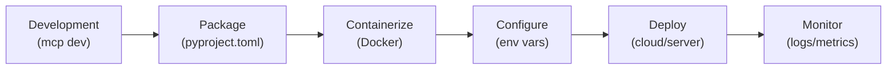
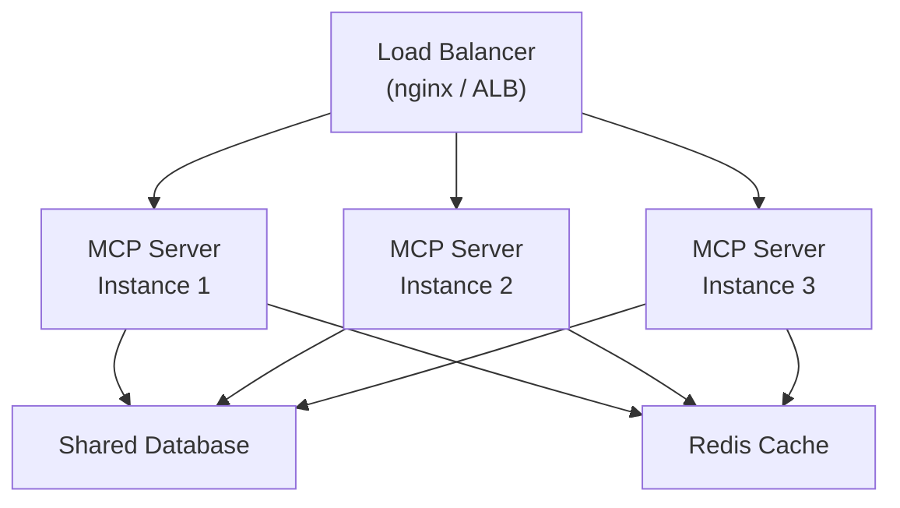

# Chapter 14: Deploying MCP Servers to Production

## Learning Objectives

By the end of this chapter, you will:

- Package an MCP server for distribution
- Containerize with Docker
- Configure for production environments
- Set up monitoring and health checks
- Scale with stateless HTTP transport

---

## From Development to Production

Moving an MCP server to production involves several steps:



---

## Step 1: Packaging

### `pyproject.toml`

Ensure your project has a proper `pyproject.toml`:

```toml
[project]
name = "weather-mcp-server"
version = "1.0.0"
description = "MCP server providing weather information"
readme = "README.md"
requires-python = ">=3.10"
dependencies = [
    "mcp[cli]>=1.0.0",
    "httpx>=0.27.0",
]

[project.scripts]
weather-server = "weather_server.server:main"

[build-system]
requires = ["hatchling"]
build-backend = "hatchling.build"
```

### Entry Point

Structure your server with a callable entry point:

```python
# weather_server/server.py
from mcp.server.mcpserver import MCPServer

mcp = MCPServer("WeatherServer", version="1.0.0")


@mcp.tool()
def get_weather(city: str) -> str:
    """Get current weather for a city."""
    # ... implementation
    return f"Weather for {city}: 22°C, Sunny"


def main():
    """Entry point for the server."""
    import sys

    transport = "streamable-http" if "--http" in sys.argv else "stdio"
    if transport == "streamable-http":
        mcp.run(transport="streamable-http", host="0.0.0.0", port=8000, json_response=True)
    else:
        mcp.run(transport="stdio")


if __name__ == "__main__":
    main()
```

### Publishing to PyPI

```bash
# Build the package
uv build

# Publish (requires PyPI credentials)
uv publish
```

Users can then install and run:

```bash
pip install weather-mcp-server
weather-server            # stdio mode
weather-server --http     # HTTP mode
```

---

## Step 2: Docker Containerization

### Dockerfile

```dockerfile
FROM python:3.12-slim

WORKDIR /app

# Install uv for fast dependency management
RUN pip install uv

# Copy dependency files first (cache layer)
COPY pyproject.toml uv.lock* ./

# Install dependencies
RUN uv sync --no-dev --frozen 2>/dev/null || uv pip install -e .

# Copy application code
COPY . .

# Expose the HTTP port
EXPOSE 8000

# Health check
HEALTHCHECK --interval=30s --timeout=5s --retries=3 \
    CMD python -c "import httpx; httpx.get('http://localhost:8000/health')" || exit 1

# Run with streamable HTTP transport
CMD ["uv", "run", "python", "server.py", "--http"]
```

### `.dockerignore`

```
__pycache__
*.pyc
.venv
.git
.env
*.egg-info
dist
build
```

### Build and Run

```bash
# Build the image
docker build -t weather-mcp-server .

# Run with environment variables
docker run -d \
    --name weather-server \
    -p 8000:8000 \
    -e API_KEY=sk-your-key \
    -e LOG_LEVEL=info \
    weather-mcp-server
```

### Docker Compose

For multi-server deployments:

```yaml
# docker-compose.yml
version: "3.8"

services:
  weather-server:
    build: ./weather-server
    ports:
      - "8001:8000"
    environment:
      - WEATHER_API_KEY=${WEATHER_API_KEY}
      - LOG_LEVEL=info
    restart: unless-stopped

  db-server:
    build: ./db-server
    ports:
      - "8002:8000"
    environment:
      - DATABASE_URL=${DATABASE_URL}
      - LOG_LEVEL=info
    restart: unless-stopped
    depends_on:
      - postgres

  postgres:
    image: postgres:16
    environment:
      - POSTGRES_DB=myapp
      - POSTGRES_USER=user
      - POSTGRES_PASSWORD=${POSTGRES_PASSWORD}
    volumes:
      - pgdata:/var/lib/postgresql/data

volumes:
  pgdata:
```

---

## Step 3: Configuration Management

### Environment Variables

Use environment variables for all configuration:

```python
import os
import logging
from dataclasses import dataclass, field


@dataclass
class ServerConfig:
    """Server configuration from environment variables."""

    # Server settings
    host: str = "0.0.0.0"
    port: int = 8000
    transport: str = "streamable-http"
    log_level: str = "INFO"

    # Feature flags
    enable_admin_tools: bool = False
    max_results: int = 100
    request_timeout: int = 30

    # Secrets
    api_key: str = ""

    @classmethod
    def from_env(cls) -> "ServerConfig":
        return cls(
            host=os.getenv("MCP_HOST", cls.host),
            port=int(os.getenv("MCP_PORT", cls.port)),
            transport=os.getenv("MCP_TRANSPORT", cls.transport),
            log_level=os.getenv("LOG_LEVEL", cls.log_level),
            enable_admin_tools=os.getenv("ENABLE_ADMIN", "false").lower() == "true",
            max_results=int(os.getenv("MAX_RESULTS", cls.max_results)),
            request_timeout=int(os.getenv("REQUEST_TIMEOUT", cls.request_timeout)),
            api_key=os.getenv("API_KEY", ""),
        )


config = ServerConfig.from_env()
logging.basicConfig(level=getattr(logging, config.log_level))
```

### `.env` File (Local Development Only)

```env
# .env (NEVER commit this file)
MCP_HOST=0.0.0.0
MCP_PORT=8000
MCP_TRANSPORT=streamable-http
LOG_LEVEL=DEBUG
API_KEY=sk-dev-key-12345
ENABLE_ADMIN=false
MAX_RESULTS=50
```

---

## Step 4: Monitoring & Observability

### Structured Logging

```python
import logging
import json
from datetime import datetime

logger = logging.getLogger("mcp_server")


class StructuredFormatter(logging.Formatter):
    def format(self, record):
        log_entry = {
            "timestamp": datetime.utcnow().isoformat(),
            "level": record.levelname,
            "message": record.getMessage(),
            "logger": record.name,
        }
        if hasattr(record, "tool_name"):
            log_entry["tool"] = record.tool_name
        if hasattr(record, "duration_ms"):
            log_entry["duration_ms"] = record.duration_ms
        return json.dumps(log_entry)


# Setup
handler = logging.StreamHandler()
handler.setFormatter(StructuredFormatter())
logger.addHandler(handler)
logger.setLevel(logging.INFO)
```

### Tool Call Metrics

```python
import time
from functools import wraps


def track_tool_call(func):
    """Decorator to track tool call metrics."""
    @wraps(func)
    async def wrapper(*args, **kwargs):
        start = time.time()
        tool_name = func.__name__

        try:
            result = await func(*args, **kwargs)
            duration = (time.time() - start) * 1000

            logger.info(
                f"Tool call succeeded: {tool_name}",
                extra={
                    "tool_name": tool_name,
                    "duration_ms": round(duration, 2),
                }
            )
            return result

        except Exception as e:
            duration = (time.time() - start) * 1000
            logger.error(
                f"Tool call failed: {tool_name} — {e}",
                extra={
                    "tool_name": tool_name,
                    "duration_ms": round(duration, 2),
                }
            )
            raise

    return wrapper


# Usage
@mcp.tool()
@track_tool_call
async def get_weather(city: str) -> str:
    """Get current weather."""
    # ...
```

### Health Check Endpoint

For Streamable HTTP servers, add a health check:

```python
# If using a custom ASGI setup
from starlette.applications import Starlette
from starlette.responses import JSONResponse
from starlette.routing import Route


async def health_check(request):
    """Health check endpoint."""
    return JSONResponse({
        "status": "healthy",
        "server": "WeatherServer",
        "version": "1.0.0",
        "uptime_seconds": time.time() - start_time,
    })


# Add alongside your MCP routes
routes = [
    Route("/health", health_check),
    # ... MCP routes
]
```

---

## Step 5: Scaling

### Stateless HTTP for Horizontal Scaling

Use stateless mode to deploy behind a load balancer:

```python
mcp.run(
    transport="streamable-http",
    host="0.0.0.0",
    port=8000,
    stateless_http=True,  # No session state
)
```

### Architecture for Scale



### Nginx Configuration

```nginx
upstream mcp_servers {
    least_conn;
    server mcp-server-1:8000;
    server mcp-server-2:8000;
    server mcp-server-3:8000;
}

server {
    listen 443 ssl;
    server_name mcp.example.com;

    ssl_certificate /etc/ssl/certs/mcp.crt;
    ssl_certificate_key /etc/ssl/private/mcp.key;

    location /mcp {
        proxy_pass http://mcp_servers;
        proxy_http_version 1.1;
        proxy_set_header Upgrade $http_upgrade;
        proxy_set_header Connection "upgrade";
        proxy_set_header Host $host;
        proxy_read_timeout 300s;
    }

    location /health {
        proxy_pass http://mcp_servers;
    }
}
```

---

## Step 6: CI/CD

### GitHub Actions

```yaml
# .github/workflows/deploy.yml
name: Deploy MCP Server

on:
  push:
    branches: [main]

jobs:
  test:
    runs-on: ubuntu-latest
    steps:
      - uses: actions/checkout@v4
      - uses: actions/setup-python@v5
        with:
          python-version: "3.12"
      - run: pip install uv
      - run: uv sync
      - run: uv run pytest

  build:
    needs: test
    runs-on: ubuntu-latest
    steps:
      - uses: actions/checkout@v4
      - name: Build Docker image
        run: docker build -t mcp-server:${{ github.sha }} .
      - name: Push to registry
        run: |
          docker tag mcp-server:${{ github.sha }} registry.example.com/mcp-server:latest
          docker push registry.example.com/mcp-server:latest

  deploy:
    needs: build
    runs-on: ubuntu-latest
    steps:
      - name: Deploy to production
        run: |
          # Your deployment command here
          # e.g., kubectl set image deployment/mcp-server ...
          echo "Deploying..."
```

---

## Production Deployment Checklist

### Before Deploy

- [ ] All tests pass
- [ ] Environment variables documented
- [ ] Secrets stored securely (not in code)
- [ ] Docker image builds successfully
- [ ] Health check endpoint works
- [ ] Logging configured with structured output

### Infrastructure

- [ ] HTTPS configured with valid certificates
- [ ] Load balancer set up (for multi-instance)
- [ ] Database connections use connection pooling
- [ ] Network policies restrict unnecessary access
- [ ] Resource limits set (CPU, memory)

### Monitoring

- [ ] Structured logging to log aggregator
- [ ] Health check monitoring with alerts
- [ ] Tool call metrics tracked
- [ ] Error rate alerting configured
- [ ] Uptime monitoring active

### Security

- [ ] Authentication implemented (OAuth 2.0 or API keys)
- [ ] Input validation on all tools
- [ ] Rate limiting in place
- [ ] CORS policies configured
- [ ] Secrets rotation planned

---

## Summary

- **Package** your server with `pyproject.toml` and entry points
- **Containerize** with Docker for consistent deployments
- **Configure** via environment variables — never hardcode secrets
- **Monitor** with structured logging, metrics, and health checks
- **Scale** using stateless HTTP mode behind a load balancer
- **Automate** deployment with CI/CD pipelines
- Follow the **production checklist** before every deployment

---

## Course Conclusion

Congratulations! You've completed the **MCP-101 course**. You now have a comprehensive understanding of:

1. **What MCP is** and why it matters for AI
2. **Architecture** — Hosts, Clients, Servers
3. **Protocol lifecycle** and capability negotiation
4. **Tools** — giving LLMs the power to act
5. **Resources** — exposing data for context
6. **Prompts** — reusable templates for workflows
7. **Transports** — stdio, SSE, Streamable HTTP
8. **Building servers** with the Python SDK
9. **Building clients** for programmatic access
10. **Sampling & elicitation** — advanced bidirectional primitives
11. **Security** best practices
12. **The ecosystem** of real-world MCP servers
13. **Multi-server orchestration** and agentic workflows
14. **Production deployment** — packaging, containers, monitoring, scaling

### Where to Go Next

- Build your own MCP server for a problem you care about
- Contribute to the [MCP specification](https://modelcontextprotocol.io)
- Explore the [Python SDK source code](https://github.com/modelcontextprotocol/python-sdk)
- Join the MCP community and share your servers
- Experiment with multi-server agentic workflows

The MCP ecosystem is growing rapidly — and you're now equipped to be part of it.
